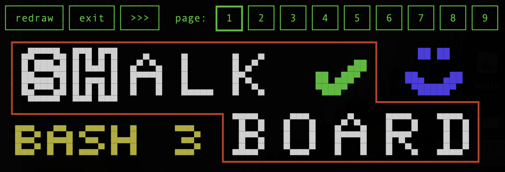

# ***sh***alkboard : a terminal based chalkboard written in Bash
***sh***alkboard is a chalkboard-like application working within any [xterm](https://en.wikipedia.org/wiki/Xterm)
compatible virtual terminal. The idea is to demonstrate that it is possible to build a complex interactive application
completely written in Bash 3.2 without any kind of library or framework.



## Why?
I was having fun parsing virtual terminal escape sequences when my son saw that I was actually drawing by clicking in
the terminal. He asked me if it was possible to change the color, the first of a list of requirement that finally
got me writing this little piece of code.

And, why Bash 3.2? Simply because it is the default Bash interpreter on MacOS. It would have been easier to work with
Bash 5, but I wanted to write something that could work virtually everywhere.

## Features

With ***sh***alkboard, it is actually possible to
- **draw** with four kind of brush,
- **write text** with 3 custom fonts,
- **copy and paste** a region of the page,
- **undo** the last action or the last group of actions,
- **reload** a page from file,
- **save** a page to file,
- **redraw** the current page.

As ***sh***alkboard only rely on terminal escape sequences that are supported by
[tmux](https://github.com/tmux/tmux/wiki), sharing a tmux session enables real-time collaborative drawing.

## Usage

```bash
# From project's root, do
./shalkboard.sh demo/demo.board
```

### Install
In order to run it anywhere without this source tree, compiling is actually compressing all the sourced files into one
script that unzips itself before execution.

```shell
# Compile
make bin/shalkboard

# Install
sudo install bin/shalkboard /usr/local/bin/

# Run
shalkboard demo/demo.board
```

### Uninstall

```shell
sudo rm /usr/local/bin/shalkboard
```

### Running tests
To run all tests :

```shell
make test
```

## References

- **[XTerm Control Sequences](https://invisible-island.net/xterm/ctlseqs/ctlseqs.html)**: This document describes all
  control sequences supported by [xterm](https://invisible-island.net/xterm/xterm.html).
- **[vttest](https://invisible-island.net/vttest/)**: As described by [Wikipedia](https://en.wikipedia.org/wiki/Vttest), *vttest is an application that is used to demonstrate features of VT100 
  and related terminals, or emulations thereof, such as [xterm](https://en.wikipedia.org/wiki/Xterm).*
  
  With the `-l` flag, this tool will also log requests and responses to vttest.log. It was quite useful to see what
  was expected by the terminal and what should be expected from it.
